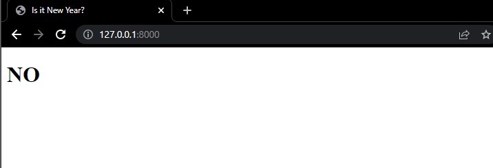

This project was created with Django

- First we begin by creating the app. Once django is installed in our machine we create the app by doing the following in the terminal:

```powershell
django-admin startproject newyear
```

- The next step is to add the in settings installed app the newyear app

```python
INSTALLED_APPS = [
    'newyear',
    'django.contrib.admin',
    'django.contrib.auth',
    'django.contrib.contenttypes',
    'django.contrib.sessions',
    'django.contrib.messages',
    'django.contrib.staticfiles',
]
```

- Then we go to the urls.py file and add the newyear urls that I want to include. It should look like this:

```py
from django.contrib import admin
from django.urls import path
from . import views

urlpatterns = [
    path('admin/', admin.site.urls),
    path("", views.index, name="index")
]
```

- If there's no views.py created then we create the file and there we firt import the <a href="https://docs.python.org/3/library/datetime.html">datetime module</a>. Then we import the <a href="https://docs.djangoproject.com/en/4.1/topics/http/shortcuts/">shortcuts template</a> from <a href="https://www.djangoproject.com">django</a>.

```py
import datetime
from django.shortcuts import render
```

- Once that is done we create our function in which we will define now by using the date time module as follows:

```py
def index(request):
    now = datetime.datetime.now()
    return render(request, 'newyear/index.html', {
        "newyear": now.month == 1 and now.day == 1
    })
```

Our views.py should look like this:

```py
import datetime
from django.shortcuts import render

# Create your views here.


def index(request):
    now = datetime.datetime.now()
    return render(request, 'newyear/index.html', {
        'newyear': now.month == 1 and now.day == 1
    })
```

- Now we create a new folder called templates under the new year directory and another folder called new year and then an index.html file.

Because we are using django, we are able to use the <a href="https://docs.djangoproject.com/en/4.1/ref/templates/builtins/">built-in templates tags and filters</a> in our index.html file.

Our html file should look like this:

```html

<!DOCTYPE html>
<html lang="en">
  <head>
    <meta charset="UTF-8" />
    <meta http-equiv="X-UA-Compatible" content="IE=edge" />
    <meta name="viewport" content="width=device-width, initial-scale=1.0" />
    <title>Is it New Year?</title>
  </head>
  <body>
    <!--  Adding the logic using django bult-in tags and filters  -->
    
    <h1>YES</h1>
    
    <h1>NO</h1>
    
  </body>
</html>
```

All is left is to run the server:

```powershell
python manage.py runserver
```

It should look like this:



<br>

- If we want to see what will happen when is new year, we can go to view.py and set newyear to True.

```py
'newyear': True
```

- Now we need to add some styling to the html, so our case, we'll be creating a new folder called static inside the newyear folder and then create another folder called newyear and inside of it our style.css file.

- Once our style is done we go back to our index file and make sure to add the link:css to the index.html file and since we are using <a href="https://docs.djangoproject.com/en/4.1/howto/static-files/">static files</a> from django we have to do it like this:

```html
<link rel="stylesheet" href="" />
```
